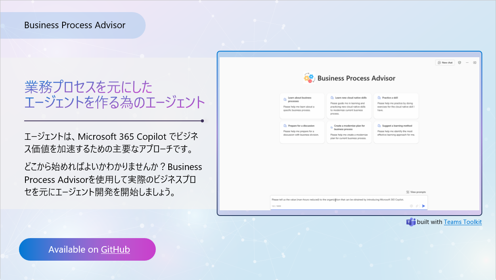

# Overview of the Business Process Advisor declarative agent sample

「Business Process Advisor」宣言型エージェントは、ユーザーが複雑なビジネスプロセスを単純、中、詳細な要約に分解することにより、理解を支援するように設計されたオープンソースのAI駆動型ツールです。このエージェントは、複雑なビジネス プロセスに対するユーザーの理解を深め、Microsoft サービスを使用して望ましい技術的アプローチを明確にし、目標とニーズに合わせた適切な学習プロセスを定義することに専念する、支援的で知識豊富なコンサルタントとして機能します。

Business Process Advisorの主な機能は次のとおりです。:

- **複雑なビジネスプロセスを分解し、問題点を理解する** : 複雑なビジネスプロセスを、類推、比喩、さまざまな視点を使用して、初心者、中級、上級レベルに簡素化します。さらに検討するための用語集と追加リソースを提供します。

- **ユーザーが Microsoft サービスを使用してビジネス プロセスの最新化を実現する方法をアドバイスする**: ビジネス プロセスの最新化を実現するために使用できる Microsoft サービスをユーザーが特定するのに役立ちます。

- **最適な学習プロセスへ導く**: ユーザーが学習目標を明確にし、好みの学習スタイルを評価し、適切な学習手法とリソースを推奨するのを支援します。

- **構造化された学習プランの作成**: 特定のトピックについて構造化された学習計画を作成し、ユーザーが必要に応じて計画を修正および更新できるようにします。

- **Q&Aの準備**: ターゲットを絞った Q&A ディスカッション プランを提供し、各 Q&A 項目の動機を説明し、練習問題を提供し、知識のギャップを特定し、Q&A エクスペリエンスをシミュレートし、Q&A ディスカッション戦略を推奨します。

Business Process Advisorは、インタラクション全体を通じてプロフェッショナルで協力的なトーンを維持し、会話が文脈に即し、関連性があることを確認します。OneDrive、SharePoint、Web 検索、Graph コネクタと統合して、機能を強化します。エージェントは、ユーザーのニーズ、興味、目標に基づいてコンテンツを適応させるように設計されており、ユーザーを圧倒しないように、簡潔でシンプルかつ論理的な方法で情報を提示します。

このオープンソース プロジェクトは、構造化されたガイダンスとサポートを通じて、ビジネス プロセスを最新化する方法についての全体像を把握するという目標を個人が達成できるようにすることを目的としています。Business Process Advisor Declarative Agent は、カスタマイズ可能で拡張可能なフレームワークを提供することで、さまざまなビジネス プロセスの最新化コンテキストとユーザー ニーズに適合させることができ、個人的および専門的な開発のための汎用性の高いツールになります。

## 基本的な宣言型エージェントを構築する

宣言型エージェントを使用すると、専門知識、特定のプロセスの実装、または単に一連の AI プロンプトを再利用して時間を節約するなど、特定のシナリオで使用できる Copilot のカスタム バージョンを構築できます。たとえば、食料品の買い物 Copilot 宣言型エージェントを使用して、Copilot に送信する食事プランに基づいて食料品リストを作成できます。

## サンプルの使用を開始する

> **前提条件**
>
> このアプリ サンプルをローカルの開発用コンピューターで実行するには、次のものが必要です:
>
> - [Node.js](https://nodejs.org/), supported versions: 16, 18
> - A [Microsoft 365 account for development](https://docs.microsoft.com/microsoftteams/platform/toolkit/accounts).
> - [Teams Toolkit Visual Studio Code Extension](https://aka.ms/teams-toolkit) version 5.0.0 and higher or [Teams Toolkit CLI](https://aka.ms/teamsfx-toolkit-cli)
> - [Microsoft 365 Copilot license](https://learn.microsoft.com/microsoft-365-copilot/extensibility/prerequisites#prerequisites)

1. まず、VS Code ツール バーの左側にある Teams Toolkit アイコンを選択します。

2. [アカウント] セクションで、[Microsoft 365 アカウント](https://docs.microsoft.com/microsoftteams/platform/toolkit/accounts) でサインインします (まだサインインしていない場合は)。

3. [ライフサイクル] セクションの [プロビジョニング] をクリックして、Teams アプリを作成します。

4. 起動設定のドロップダウンから `Preview in Copilot (Edge)` または `Preview in Copilot (Chrome)` を選択します。

5. Copilot アプリがブラウザに読み込まれたら、「...」メニューをクリックし、`Copilot Chats`を選択します。右側のレールに宣言型エージェントが表示されます。それをクリックすると、宣言型エージェントのロゴと名前が表示されるようにエクスペリエンスが変わります。

6. 宣言型エージェントに質問すると、提供された指示に基づいて応答するはずです。

## サンプルに含まれるもの

| フォルダー       | 内容                                                                                 |
| ------------ | ---------------------------------------------------------------------------------------- |
| `.vscode`    | デバッグ用の VSCode ファイル                                                               |
| `appPackage` | Teams アプリケーション マニフェスト、GPT マニフェスト、API 仕様のテンプレート |
| `env`        | 環境変数                                                                        |

次のファイルはカスタマイズでき、実装例を示して開始できます。

| ファイル                                 | 内容                                                                       |
| ------------------------------------ | ------------------------------------------------------------------------------ |
| `appPackage/declarativeAgent.json` | 宣言型エージェントの動作と構成を定義します。            |
| `appPackage/manifest.json`           | 宣言型エージェントのメタデータを定義する Teams アプリケーション マニフェスト。 |

Teams Toolkit 固有のプロジェクト ファイルを次に示します。[Github の完全なガイド](https://github.com/OfficeDev/TeamsFx/wiki/Teams-Toolkit-Visual-Studio-Code-v5-Guide#overview) にアクセスして、Teams Toolkit のしくみを理解できます。

| ファイル           | 内容                                                                                                                                  |
| -------------- | ----------------------------------------------------------------------------------------------------------------------------------------- |
| `teamsapp.yml` | これは、メインの Teams Toolkit プロジェクト ファイルです。プロジェクト・ファイルでは、プロパティと構成ステージ定義の 2 つの主要なものを定義します。 |

## 追加情報と参考資料

- [Declarative agents for Microsoft 365](https://aka.ms/teams-toolkit-declarative-agent)
- [Microsoft 365 Copilot Extensibility Sample](https://learn.microsoft.com/en-us/microsoft-365-copilot/extensibility/samples)