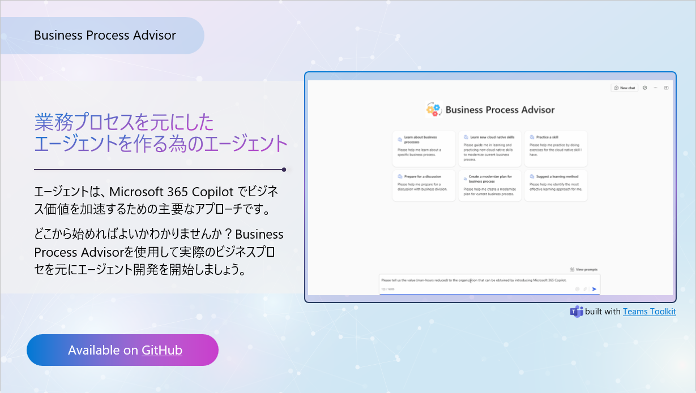

# Overview of the Business Process Advisor declarative agent sample

The "Business Process Advisor" Declarative Agent is an open-source AI-driven tool designed to assist users in understanding complex business process by breaking them down into simple, intermediate, and detailed summaries. This agent acts as a supportive and knowledgeable consultant, dedicated to enhancing users' understanding of complex business process, clarifying desired technical approach using Microsoft services, and defining the right learning process tailored to their goals and needs.

Key features of the Business Process Advisor include:

- **Breaking Down Complex Business Process and Understand the pain point** : Simplifies complex business process into beginner, intermediate, and advanced levels, using analogies, metaphors, and different point of view. Provides glossaries and additional resources for further consideration.

- **Advise how users achieve business process modernization with Microsoft services**: Helps user identifying which Microsoft services can be used to achieve business process modernization.

- **Guiding Optimal Learning Processes**: Assists users in articulating their learning goals, assessing their preferred learning styles, and recommending suitable learning techniques and resources.

- **Creating Structured Learning Plans**: Develops structured study plans for specified topics, allowing users to revise and update the plans as needed.

- **Q&A Preparation**: Offers targeted Q&A discussion plans, explains the motivation of each Q&A items, provides practice questions, identifies knowledge gaps, simulates Q&A experiences, and recommends Q&A discussion strategies.

The Business Process Advisor maintains a professional and supportive tone throughout interactions, ensuring that conversations are contextual and relevant. It integrates with OneDrive, SharePoint, Web search, and Graph Connectors to enhance its capabilities. The agent is designed to adapt its content based on the user's needs, interests, and goals, presenting information in a brief, simple, and logical manner to avoid overwhelming the user.

This open-source project aims to empower individuals to achieve their goals of getting a big picture about how they modernize business process through structured guidance and support. By providing a customizable and extensible framework, the Business Process Advisor Declarative Agent can be adapted to various business process modernization contexts and user needs, making it a versatile tool for personal and professional development.

## Build a basic declarative agent

With the declarative agent, you can build a custom version of Copilot that can be used for specific scenarios, such as for specialized knowledge, implementing specific processes, or simply to save time by reusing a set of AI prompts. For example, a grocery shopping Copilot declarative agent can be used to create a grocery list based on a meal plan that you send to Copilot.

## Get started with the sample

> **Prerequisites**
>
> To run this app sample in your local dev machine, you will need:
>
> - [Node.js](https://nodejs.org/), supported versions: 16, 18
> - A [Microsoft 365 account for development](https://docs.microsoft.com/microsoftteams/platform/toolkit/accounts).
> - [Teams Toolkit Visual Studio Code Extension](https://aka.ms/teams-toolkit) version 5.0.0 and higher or [Teams Toolkit CLI](https://aka.ms/teamsfx-toolkit-cli)
> - [Microsoft 365 Copilot license](https://learn.microsoft.com/microsoft-365-copilot/extensibility/prerequisites#prerequisites)

1. First, select the Teams Toolkit icon on the left in the VS Code toolbar.

2. In the Account section, sign in with your [Microsoft 365 account](https://docs.microsoft.com/microsoftteams/platform/toolkit/accounts) if you haven't already.

3. Create Teams app by clicking `Provision` in "Lifecycle" section.

4. Select `Preview in Copilot (Edge)` or `Preview in Copilot (Chrome)` from the launch configuration dropdown.

5. Once the Copilot app is loaded in the browser, click on the "…" menu and select "Copilot chats". You will see your declarative agent on the right rail. Clicking on it will change the experience to showcase the logo and name of your declarative agent.

6. Ask a question to your declarative agent and it should respond based on the instructions provided.

## What's included in the sample

| Folder       | Contents                                                                                 |
| ------------ | ---------------------------------------------------------------------------------------- |
| `.vscode`    | VSCode files for debugging                                                               |
| `appPackage` | Templates for the Teams application manifest, the GPT manifest and the API specification |
| `env`        | Environment files                                                                        |

The following files can be customized and demonstrate an example implementation to get you started.

| File                                 | Contents                                                                       |
| ------------------------------------ | ------------------------------------------------------------------------------ |
| `appPackage/declarativeAgent.json` | Define the behavior and configurations of the declarative agent.            |
| `appPackage/manifest.json`           | Teams application manifest that defines metadata for your declarative agent. |

The following are Teams Toolkit specific project files. You can [visit a complete guide on Github](https://github.com/OfficeDev/TeamsFx/wiki/Teams-Toolkit-Visual-Studio-Code-v5-Guide#overview) to understand how Teams Toolkit works.

| File           | Contents                                                                                                                                  |
| -------------- | ----------------------------------------------------------------------------------------------------------------------------------------- |
| `teamsapp.yml` | This is the main Teams Toolkit project file. The project file defines two primary things: Properties and configuration Stage definitions. |

## Addition information and references

- [Declarative agents for Microsoft 365](https://aka.ms/teams-toolkit-declarative-agent)
- [Microsoft 365 Copilot Extensibility Sample](https://learn.microsoft.com/en-us/microsoft-365-copilot/extensibility/samples)